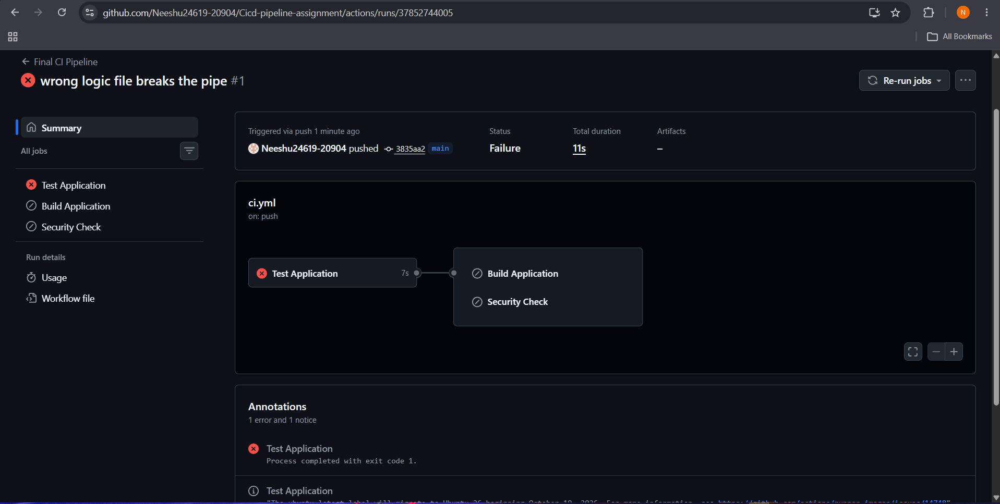
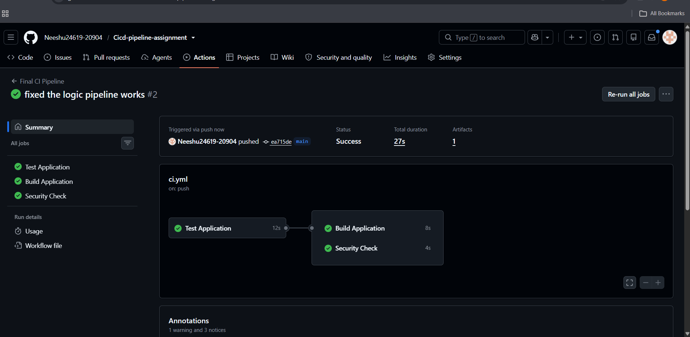

# Final CI/CD Pipeline

## Overview
Implemented a basic CI/CD pipeline for a Python calculator application using GitHub Actions.

## Pipeline Flow
`git push → GitHub Actions → Test → Security Check → Build → Artifact`

## Jobs
- **Test:** Checks out the code, sets up Python, installs dependencies, and runs `pytest`.
- **Security Check:** Checks the repository for sensitive files such as `.env`, `.pem`, and `.key`.
- **Build:** Builds the application and generates the `build/` directory.

## Job Logic
The Build job uses `needs: test`, so it runs only when the tests pass.

## Artifact
The build output is uploaded as a GitHub Actions artifact named `calculator-build`.

## Runner
All jobs run on GitHub's `ubuntu-latest` runner.

## Failure Testing
Intentionally changed `add(a, b)` to return `a + b + 1` to break a test.

The test failed, and because Build depends on Test, the Build job was skipped.

After restoring the correct implementation (`a + b`) and pushing the fix, all pipeline jobs passed successfully.

## Key Learning
This project demonstrates automated testing, basic security checking, job dependencies, build automation, and artifact generation using GitHub Actions.

## Screenshots

